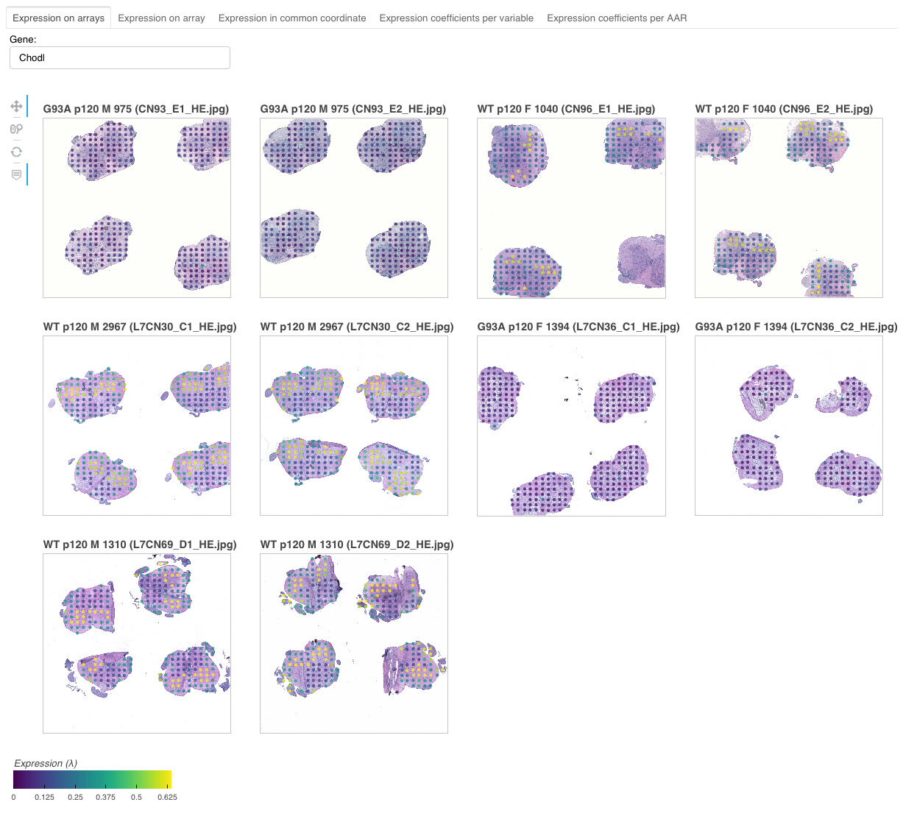
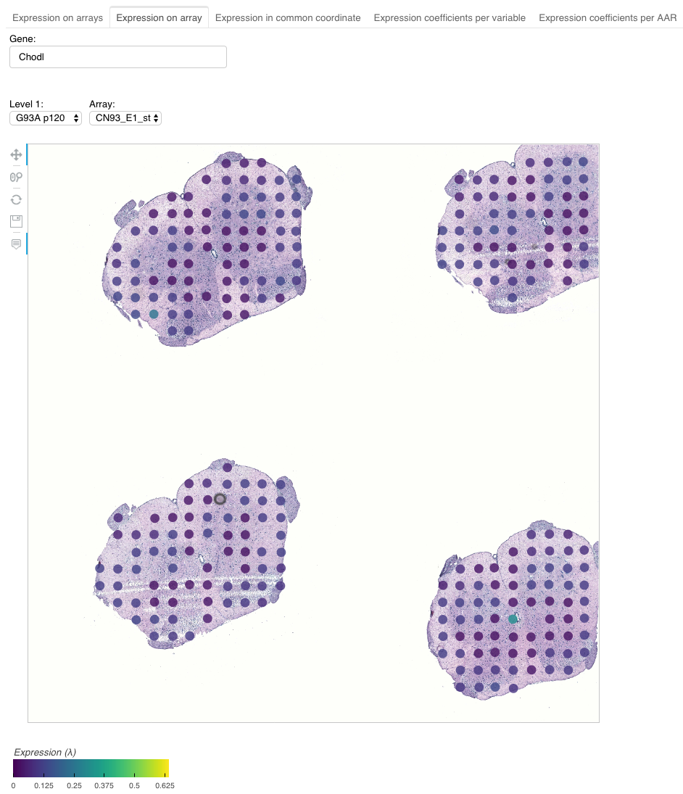
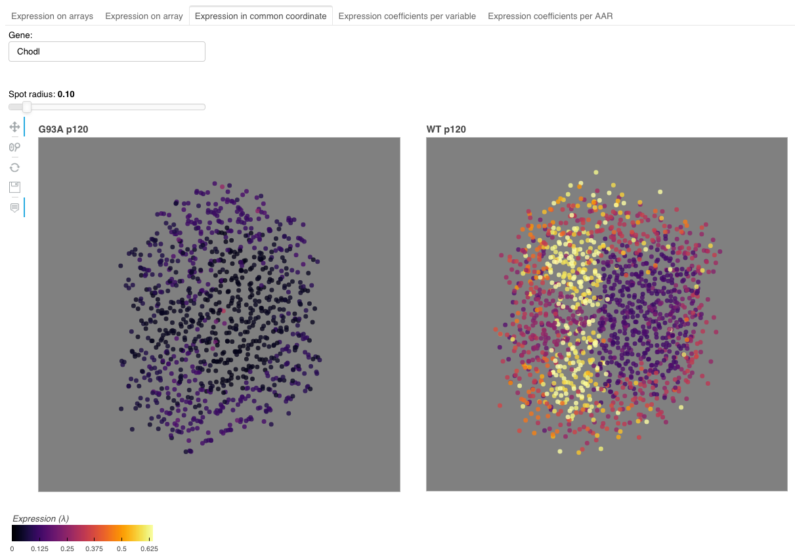
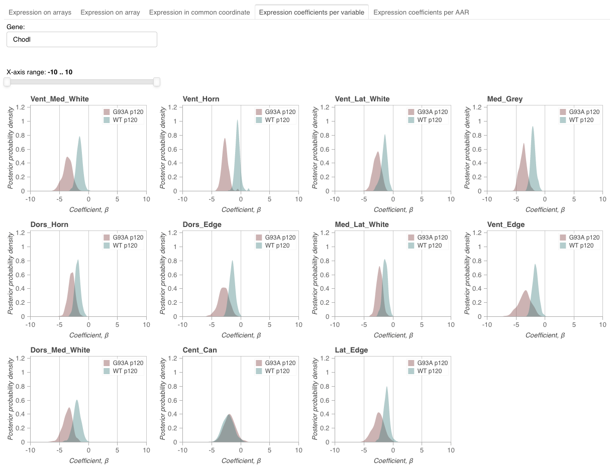
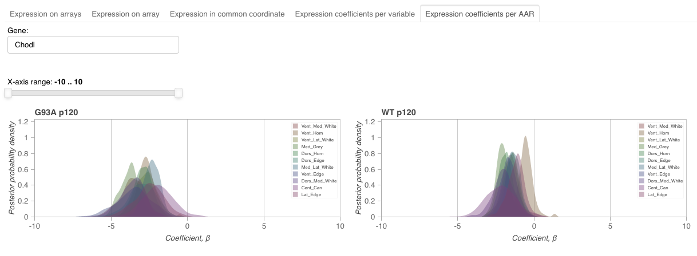

# Spav
A tool for visualizing [Splotch](https://github.com/tare/Splotch) results.

## Overview
A custom version of Spav is used on [https://als-st.nygenome.org](https://als-st.nygenome.org).

Spav currently supports five different interactive views for visualizing and exploring Splotch results.

### Expression on arrays


This view visualizes expression estimates on all the arrays simultaneously.

### Expression on array


This view visualizes expression estimates on a selected array. The user can filter arrays based on the level 1 information (see [Splotch](https://github.com/tare/Splotch)).

### Expression in common coordinate


This view visualizes expression estimates in common coordinate system. The expression estimates are separated based on the level 1 information.

### Expression coefficients per level 1 variable


This view visualizes expression coefficients across level 1 variables for each AAR.

### Expression coefficients per anatomical annotation region (AAR)


This view visualizes expression coefficients across AARs for each level 1 variable.

## Usage

### Installation
Spav has been tested on Python 3.7.

Spav can be installed as follows
```console
$ pip install git+https://git@github.com/tare/Spav.git
```

### Data preparation
The script ``spav_prepare_data`` can be used for preparing the Splotch results to be used with Spav
```console
$ spav_prepare_data --help
usage: spav_prepare_data [-h] -d DATA_DIRECTORY -o OUTPUT_DIRECTORY -s
                         SERVER_DIRECTORY [-c] [-v]

A script for preparing Splotch results for Span

optional arguments:
  -h, --help            show this help message and exit
  -d DATA_DIRECTORY, --data-directory DATA_DIRECTORY
                        data directory
  -o OUTPUT_DIRECTORY, --output-directory OUTPUT_DIRECTORY
                        output directory
  -s SERVER_DIRECTORY, --server-directory SERVER_DIRECTORY
                        server directory
  -c, --no-copy         create symbolic links instead of copying images
  -v, --version         show program's version number and exit
```

For instance, if your Splotch input and output directories are ``$DATA_DIRECTORY`` and ``$OUTPUT_DIRECTORY`` (see [Splotch](https://github.com/tare/Splotch)), respectively, then you can prepare the data for Spav by executing the following command
```console
$ spav_prepare_data -d $DATA_DIRECTORY -o $OUTPUT_DIRECTORY -s $SPAV_DIRECTORY
```
This command will create the directories ``$SPAV_DIRECTORY/static`` and ``$SPAV_DIRECTORY/data``.
The directory ``$SPAV_DIRECTORY/static`` contains symbolic links pointing to the bright-field images and the ``$SPAV_DIRECTORY/data.hdf5`` file contains the estimates.

### Deployment

#### Standalone Bokeh server
For detailed description of how run a Bokeh server, please see [https://bokeh.pydata.org/en/latest/docs/user_guide/server.html](https://bokeh.pydata.org/en/latest/docs/user_guide/server.html).

The script ``server/main.py`` implements our Bokeh application
```console
$ python main.py --help
usage: main.py [-h] [--arrays] [--array] [--common-coordinate]
               [--aar-coefficients] [--level-coefficients] [-v]

Spav

optional arguments:
  -h, --help            show this help message and exit
  --arrays              show the array view
  --array               show the arrays view
  --common-coordinate   show the common coordinate view
  --aar-coefficients    show the aar coefficient view
  --level-coefficients  show the level coefficient view
  -v, --version         show program's version number and exit
```
Additionally, the directory ``server`` contains ``theme.yaml`` and ``templates/index.html``.

First, let us copy the files from the directory ``server`` to the directory we created using the ``spav_prepare_data`` script
```console
$ cp -r server/* $SPAV_DIRECTORY/ 
```
Second, the Bokeh application with all the implemented views can started by executing the following command
```console
$ bokeh serve $SPAV_DIRECTORY --show --args --arrays --array --common-coordinate --aar-coefficients --level-coefficients
```

#### Embedding the Bokeh server inside a Jupyter notebook
Please see [Notebook.ipynb](Notebook.ipynb).
